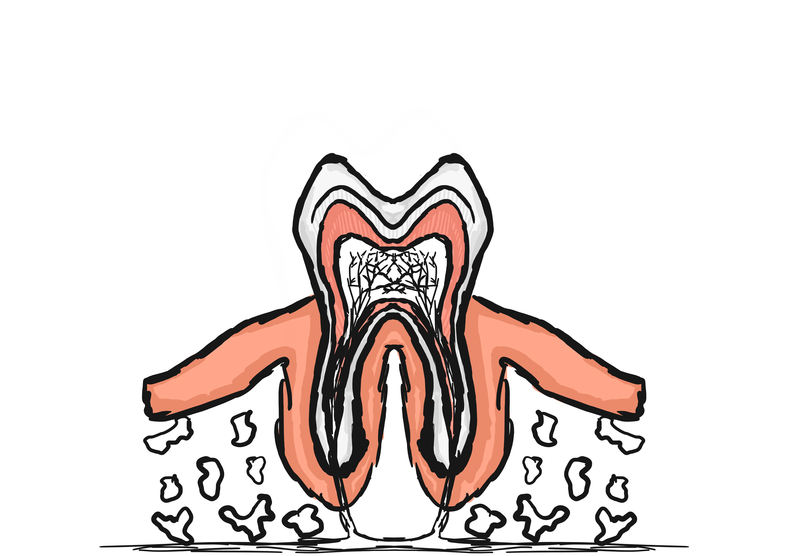
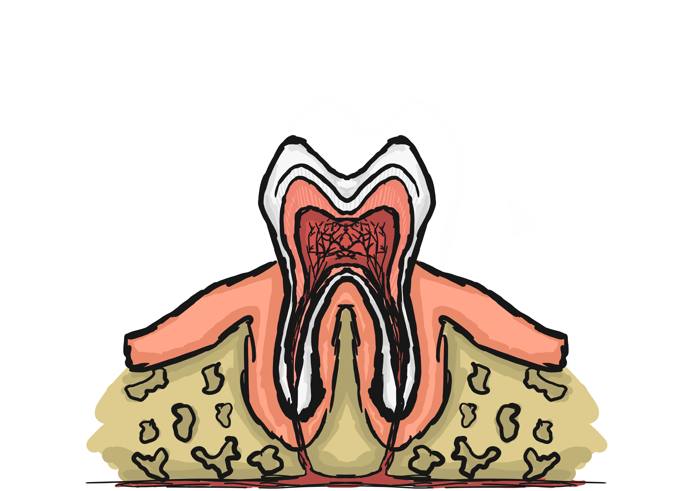

# Digital Painting - Cross section of a tooth
This project was made in Autodesk Sketchbook.

## Progress

### First session

### Second session

### Third session

### Fourth session

### Fifth, final session

